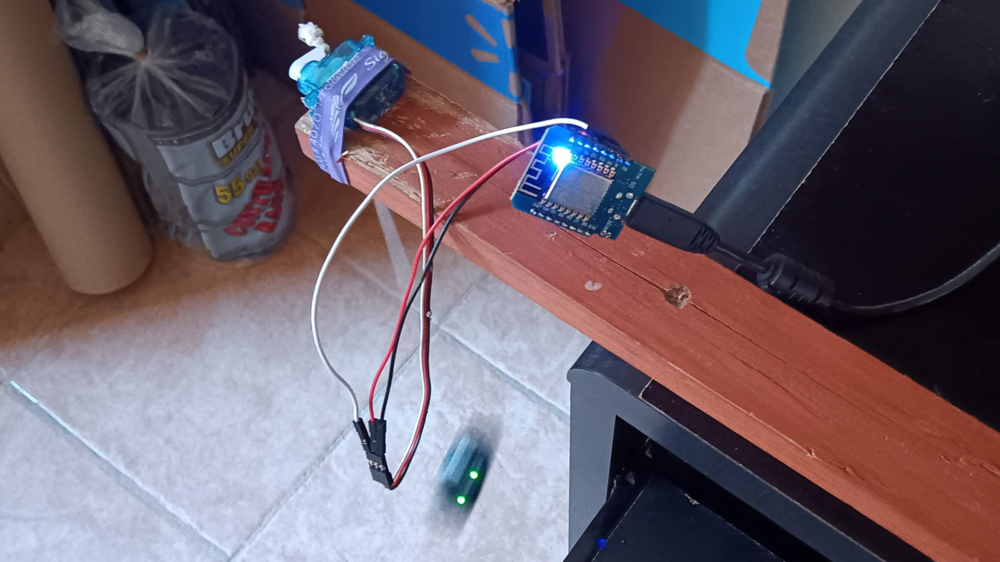

**Fitbit Faker**

A silly project to fake FitBit steps.

Connect your Fitbit to a servo with a 18" length of string.  
Compile and download the code with PlatformIO using either an Arduino Uno or Wemos D1 Mini Esp8266.  
Secure the servo so as to allow the FitBit to swing freely.  
Yields at least one step per second.
Enjoy.  

Video:

https://github.com/keithehenry/Fitbit-Faker/assets/1779413/f40b3c09-43b4-40d9-93d1-80388c97b040
